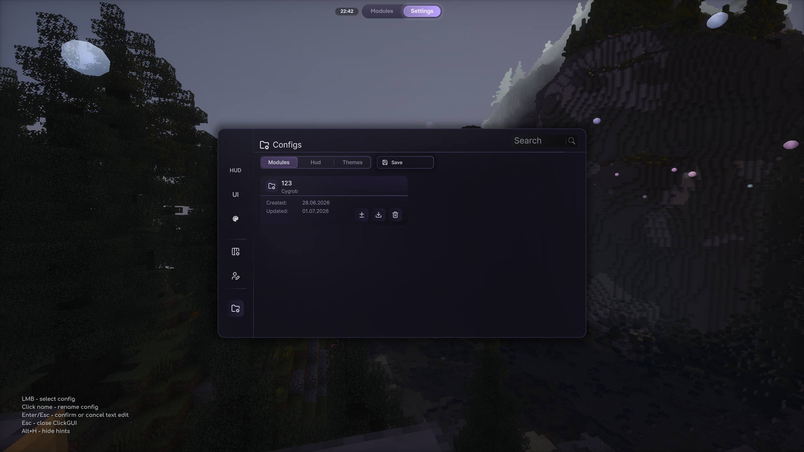
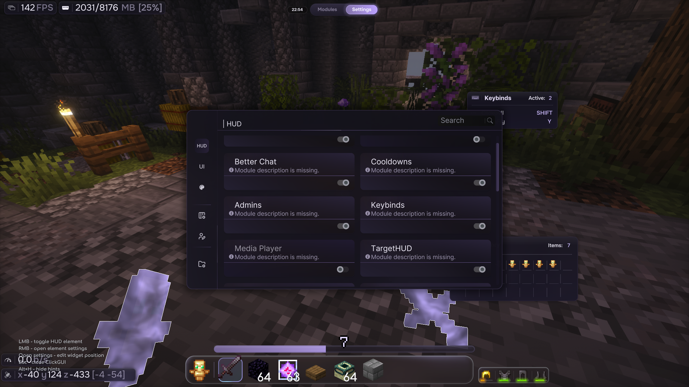
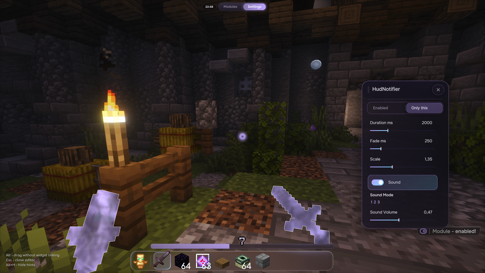
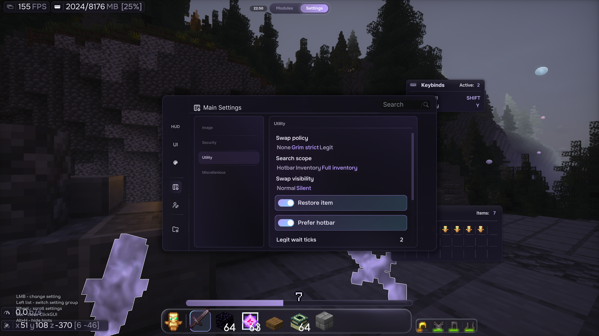

# Configs and HUD Guide

This guide explains how Combatant profiles work, how to load them, and how to set up HUD elements.

## Config profiles

Combatant config profiles are `.cbcfg` files. They are used to save and load parts of your setup without replacing the whole client config by hand.

The Configs screen has three profile types:

- `Modules` - module enabled state and module settings.
- `Hud` - HUD elements, draggable layout, and HUD element settings.
- `Themes` - ClickGUI/theme settings.

A full shared setup is usually at least one `Modules` profile plus one `Hud` profile. If somebody sends only a modules profile, it will not necessarily include their HUD layout.

Profiles are stored in:

```text
config/combatant/profiles/
```

Inside that folder, profiles are split by type:

```text
config/combatant/profiles/modules/
config/combatant/profiles/hud/
config/combatant/profiles/themes/
```

For a normal Minecraft install this is inside the game directory, usually `.minecraft/config/combatant/profiles/`.

## Configs screen

Open the ClickGUI, go to `Settings`, then open `Configs`.



Use the top tabs to choose what you are working with:

- `Modules` for module profiles.
- `Hud` for HUD profiles.
- `Themes` for theme profiles.

Basic controls:

- `Save` creates a new `.cbcfg` profile from the currently selected type.
- Left click a profile card to select it.
- Click the profile name to rename it.
- The diff button opens a comparison between the selected profile and your current setup.
- The download/apply button loads that profile into the current setup.
- The trash button deletes the profile.

`Save` on the main Configs screen creates a new profile. To overwrite an existing selected profile, open its diff panel and use the save action there.

When renaming, `Enter` confirms the new name and `Esc` cancels text editing.

To load a `.cbcfg` file received from someone else, you can put it anywhere under:

```text
config/combatant/profiles/
```

Combatant reads the profile header, detects whether it is a `Modules`, `Hud`, or `Themes` profile, and moves it into the correct folder automatically.

You can also drop `.cbcfg` files directly onto the open `Settings -> Configs` screen. Drag-and-drop imports the files into the correct profile folder, but does not apply them. Select the imported profile and press the apply button when you actually want to use it.

Manual folder placement also works:

- Module profiles go into `config/combatant/profiles/modules/`.
- HUD profiles go into `config/combatant/profiles/hud/`.
- Theme profiles go into `config/combatant/profiles/themes/`.

Then open the Configs screen, select the matching tab, and apply the profile. If the file does not appear immediately, close and reopen the screen.

## HUD element list

Open `Settings -> HUD` to manage draggable HUD elements.



Basic controls:

- `LMB` toggles a HUD element on or off.
- `RMB` opens settings for that HUD element.
- Open an element's settings to edit its widget position.
- `Esc` closes the ClickGUI.
- `Alt+H` hides the on-screen hints.

If a HUD element is enabled but still not visible, check its own settings and make sure it is not placed off-screen or hidden by a condition.

## Editing a HUD element

Right click a HUD element to open its settings panel.



The editor can contain toggles, sliders, mode selectors, colors, and other settings depending on the element. The example above shows `HudNotifier`, but the same idea applies to other HUD elements.

Useful controls:

- Change values directly in the settings panel.
- Use `Only this` when you want to focus on one element while editing.
- Hold `Alt` while dragging if you need to move without widget linking.
- Press `Esc` to close the editor.
- Press `Alt+H` to hide hints.

After editing, save a `Hud` profile if you want to keep or share the layout.

## Main settings

`Settings -> Main Settings` contains global Combatant behavior.



The left list switches setting groups. The right panel contains the actual settings for the selected group.

Basic controls:

- `LMB` changes a focused setting.
- Use the left list to switch setting groups.
- Use the mouse wheel to scroll long setting lists.
- `Alt+H` hides the on-screen hints.

## FAQ

### What is a `.cbcfg` file?

A `.cbcfg` file is a Combatant profile file. It can store module settings, HUD settings, or theme settings depending on which profile tab created it.

### Does one profile contain everything?

No. Profiles are split by type. To share a full setup, share the relevant `Modules`, `Hud`, and optionally `Themes` profiles.

### Can I share profiles with another user?

Yes. Send the `.cbcfg` file. The other user can drag it onto `Settings -> Configs` or put it anywhere under `config/combatant/profiles/`; Combatant will detect the profile type from the file.

### Why did applying a profile skip some settings?

The profile may reference modules, HUD elements, settings, or addons that are not present in the current install. The apply status can report missing owners or missing values.

### How do I back up my setup?

Save the profiles you care about, then back up `config/combatant/profiles/`. For a full setup, include `modules`, `hud`, and `themes`.

### How do I reset a bad HUD layout?

Apply a known good `Hud` profile, disable the broken element from `Settings -> HUD`, or move it again through position editing.

### Do addon modules work with profiles?

Addon module settings can be part of module profiles, but the same addon must be installed when the profile is applied. If the addon is missing, those entries may be skipped.
