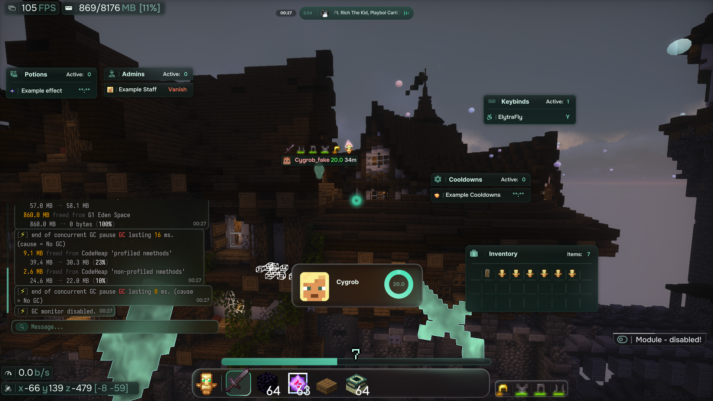
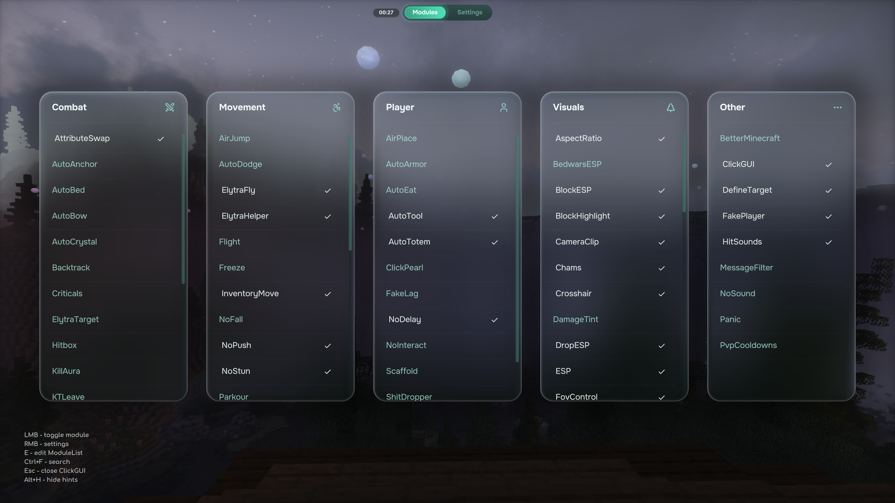
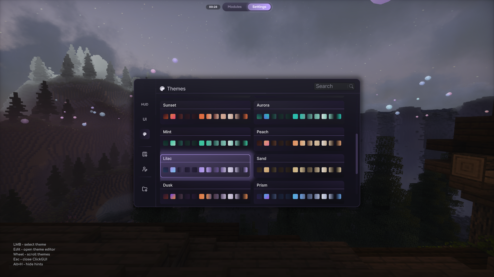

# Combatant Client

Combatant is an open-source utility and PvP client for **Minecraft 26.2 on Fabric**.

The project provides a broad set of configurable combat, movement, visual, automation, HUD, UI, and integration features, together with its own addon API.

Combatant is already usable, but it is not feature-complete. Some areas still need refinement, compatibility coverage is incomplete, and the public documentation is still being prepared.

## Screenshots

### HUD

### ClickGUI modules

### Theme menu

## Logo wanted

Combatant does not have a proper project logo yet.

Original logo proposals are welcome. Please do not submit copied artwork, traced logos, generic template edits, or low-effort AI-generated images.

## Features

Combatant includes:

- configurable PvP, movement, utility, and automation systems;
- visual information, world customization, and post-processing effects;
- a custom ClickGUI, HUD editor, theme system, and interface components;
- custom rendering and scripting infrastructure;
- an addon API for extending the client;
- optional integration with supported third-party mods.

A complete feature list and detailed documentation will be added separately.

## Supported languages

Combatant currently ships translations for:

- `en_us`
- `ru_ru`

When adding modules or other user-facing features, `en_us` localization is required. `ru_ru` localization is recommended if you know Russian.

## Runtime dependencies

Combatant requires Sodium at runtime.

Recommended version:

- [`sodium-fabric-0.9.0+mc26.2`](https://modrinth.com/mod/sodium/version/mc26.2-0.9.0-fabric)

## Project status

Active development will slow down substantially because I (primary maintainer) am leaving for military service.

Major updates should not be expected in the near future. Pull requests can still be submitted and reviewed when time permits, but review and merge times may be inconsistent.

## Contributing

Contributions are welcome.

Contributions can be small or large: serious feature work, bug fixes, compatibility updates, visual polish, UI refinements, documentation, localization, diagnostics, and addon API improvements are all useful.

Changes should be useful beyond one private setup. Features tied to one specific server, map, minigame, or network configuration are generally discouraged and are usually better implemented as addons.

Anticheat-specific improvements are acceptable when they provide practical value beyond one server and are supported by clear in-game evidence.

Read [`CONTRIBUTING.md`](CONTRIBUTING.md) before opening a pull request.

## Addons

Combatant includes an addon loader and a versioned addon API.

Use the [`combatant-addon-template`](https://github.com/pivosos2007/combatant-addon-template) repository for a minimal addon project structure, examples, and build instructions.

The addon API should be considered usable but not stability-guaranteed until the first tagged public release.

## Shaderpack patches

Combatant includes Iris shaderpack patch manifests for selected shaderpacks. See [`SHADERPACK_PATCHES.md`](SHADERPACK_PATCHES.md) for the currently targeted shaderpack versions and validation workflow.

## Building

The current source targets:

- Minecraft 26.2;
- Fabric Loader;
- Fabric API;
- Sodium;
- Java 25.

See [`BUILDING_GUIDELINES.md`](BUILDING_GUIDELINES.md) for build commands, Javet native handling, and notes for the MediaPlayerInfo native bridge.

## License

Combatant's original source code is licensed under the **GNU General Public License v3.0 only**, unless a file-level notice states otherwise.

Some parts of the project are derived from, adapted from, or designed with reference to other open-source projects and retain their applicable attribution and licensing information.

See:

- [`LICENSE`](LICENSE)
- [`CREDITS.md`](CREDITS.md)
- [`THIRD_PARTY_NOTICES.md`](THIRD_PARTY_NOTICES.md)
- [`THIRD_PARTY_LICENSES/`](THIRD_PARTY_LICENSES/)

## Disclaimer

Combatant is provided without warranty.

Users are responsible for following the rules of the servers and services they use. The maintainers are not responsible for bans, account restrictions, data loss, incompatibilities, or other consequences resulting from use of the client.
